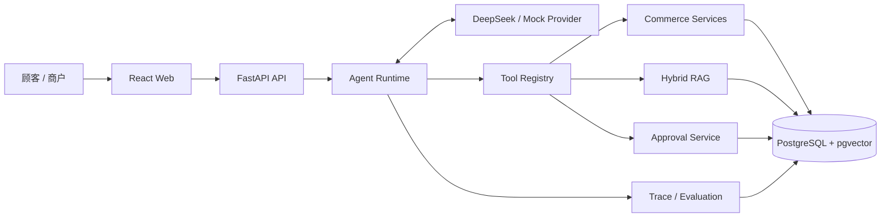

# Commerce Support Agent

[](https://github.com/Zouu-X/commerce_agent/actions/workflows/ci.yml)


[](./LICENSE)

一个可评测、可解释的电商客服 Agent Demo。系统通过真实业务工具处理商品、订单、物流、售后与
店铺政策查询；取消订单、退款和发券等写操作必须经过人工审批，并保留模型、工具和业务状态 Trace。

## 技术概览

| 部分 | 技术与设计 |
|---|---|
| Agent Runtime | Python 3.12、FastAPI、自研有界 Tool Calling Loop、OpenAI-compatible Provider |
| 业务工具 | Pydantic 工具 Schema；7 个只读工具与 3 个待审批请求工具 |
| RAG | PostgreSQL 全文检索 + BGE/pgvector 双路召回、加权 RRF、确定性 Query Decomposition |
| 写操作 | Pending Action、人工审批、事务、行锁、执行前校验与幂等约束 |
| 可观测性 | PostgreSQL Trace，记录模型/工具事件、延迟、token、费用与错误 |
| Web | React 19、TypeScript、Vite；顾客聊天页与商户控制台 |
| 工程化 | Docker Compose、GitHub Actions、pytest、mypy、Ruff、ESLint、Node Test |

## 快速启动

要求：Docker Desktop、Docker Compose、GNU Make 和 DeepSeek API Key。

```bash
cp .env.example .env
cp .env.ds.example .env.ds
# 将 DeepSeek API Key 直接写入 .env.ds
make up
make smoke
```

- 顾客聊天：<http://localhost:5173>
- 商户审批、Trace 与评测：<http://localhost:5173/merchant>
- OpenAPI：<http://localhost:8000/docs>

完整启动、演示与 curl 示例见 [本地运行与演示指南](./docs/demo-guide.md)。

## 离线评测

| 评测 | 结果 | 适用范围 |
|---|---:|---|
| [Retrieval Gold Set](./docs/evals/retrieval-baseline-7e8a925.md) | **96/100**；Recall@3 95.70%；MRR 95.70%；nDCG@5 95.21% | 评估双路召回、排序、拒答和 Query Decomposition；不包含 Agent 路由与生成 |
| [DeepSeek 3 × 60](./docs/evals/deepseek-3run-baseline-7e8a925-20260823.md) | **81/180，45.00%**；单次均值 45.00% ± 4.71 pp；总估算费用 $0.12606426 | 评估真实模型端到端工具使用、回答、延迟和费用；三次质量门均未通过，不代表生产可用性 |

```bash
make eval-retrieval # Retrieval Gold Set
make eval-mock      # 确定性工程回归，不代表真实模型质量
make eval           # 真实 DeepSeek，会产生 API 用量
```

评测设计、指标口径和复现条件见 [评测文档](./docs/evaluation.md)。机器可读的三次 DeepSeek 摘要见
[JSON 基线](./docs/evals/deepseek-3run-baseline-7e8a925-20260823.json)。

## 文档

- [技术文档索引](./docs/README.md)
- [架构与执行链](./docs/architecture.md)
- [评测体系与证据口径](./docs/evaluation.md)
- [安全边界与已知限制](./docs/security-boundaries.md)
- [本地运行与演示指南](./docs/demo-guide.md)
- [v0.1.0 发布说明](./docs/release-notes-v0.1.0.md)

## 适用边界

- 本项目是本地求职 Demo，不是生产系统。
- Scope Header 用于模拟可信身份输入，不是认证或授权机制。
- 当前没有 Provider retry/backoff、速率与费用保护、OpenTelemetry、human handoff 或公网部署配置。
- 工具调用顺序执行；不包含多 Agent、长期记忆或自主规划。
- 真实 DeepSeek 离线评测尚未达到质量门。

## 开发检查

```bash
npm --prefix frontend ci
make lint
make test
```

CI 执行后端 Ruff、mypy、pytest，以及前端 test、lint 和 build。Python 3.12/Linux 依赖版本通过
[`requirements-py312-linux.lock`](./backend/requirements-py312-linux.lock) 固定。

## 系统架构



模型不直接访问数据库；身份上下文由服务端注入，写操作进入审批流程。完整组件边界和调用顺序见
[架构文档](./docs/architecture.md)。

## License

本项目使用 [MIT License](./LICENSE)。
