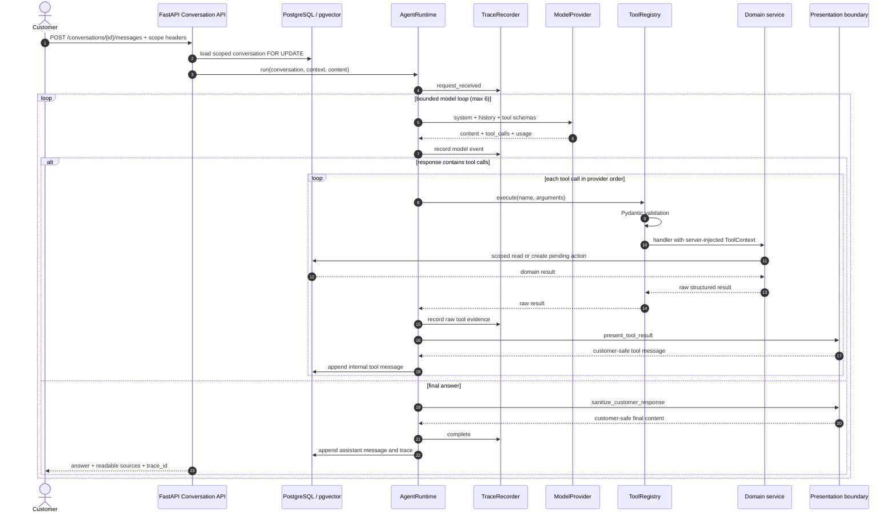

# 架构与执行链

## 目标与范围

这个项目展示的是 Agent 应用工程，而不是通用聊天模型：模型负责意图理解、工具选择和回答组织；
业务事实、数据范围和写操作权限由确定性的服务层控制。实现围绕四个可验证问题展开：

1. 模型是否通过结构化工具读取真实业务数据，而不是凭 Prompt 猜测；
2. 写操作是否先停在人工审批边界；
3. RAG 检索与回答证据是否可分层评测；
4. 一次失败能否沿 Trace 下钻到具体模型或工具事件。

项目刻意保持单 Agent、单 PostgreSQL 和本地 Docker Compose，不追求生产级分布式架构。

## 一次用户消息的真实顺序

`send_message` 先对 conversation 加行锁，避免同一会话并发 turn 争用序号。Runtime 依次执行一个
模型响应中的多个 tool call；当前没有并发工具调度。模型调用有 30 秒默认超时，单工具 10 秒，
整轮 45 秒，并受最多 6 次模型循环和 8 次工具调用限制。Provider 没有 retry/backoff。

## 模块映射

| 责任 | 主要实现 |
|---|---|
| HTTP 路由、会话锁和响应 Schema | `backend/app/api/agent.py` |
| Tool-calling loop、预算、超时、失败持久化 | `backend/app/agent/runtime.py` |
| DeepSeek / OpenAI-compatible / Mock adapter | `backend/app/agent/provider.py` |
| 工具 Schema、参数校验和 dispatch | `backend/app/tools/registry.py` |
| 只读电商工具 | `backend/app/tools/read_tools.py` |
| 知识检索工具 | `backend/app/tools/knowledge_tools.py` |
| 待审批请求工具 | `backend/app/tools/action_tools.py` |
| tenant/store/customer scope 查询 | `backend/app/commerce/services.py` |
| 混合检索和证据过滤 | `backend/app/knowledge/service.py` |
| 确定性复合意图拆分 | `backend/app/knowledge/decomposition.py` |
| 审批状态机与写入执行 | `backend/app/approvals/service.py` |
| 工具摘要与最终回复过滤 | `backend/app/agent/presentation.py` |
| Trace 事件、脱敏与失败证据 | `backend/app/observability/service.py` |
| 评测 runner | `backend/app/evaluations/runner.py`、`retrieval_runner.py` |

## 工具边界

Runtime 向模型暴露 10 个工具。工具参数 Schema 中没有 `tenant_id`、`store_id`、`customer_id`、
`conversation_id` 或 `trace_id`；这些字段由 API context 构造 `ToolContext` 后注入，模型无法通过
tool arguments 覆盖。

只读工具：

- `search_products`
- `get_product_details`
- `get_customer_orders`
- `get_order_details`
- `track_shipment`
- `get_after_sale_status`
- `search_store_policy`

待审批请求工具：

- `request_order_cancellation`
- `request_refund`
- `request_coupon`

这条边界只保证“模型参数不能改 scope”。HTTP header 本身是 Demo 身份模拟，仍可由客户端伪造；
真实认证边界见 [security-boundaries.md](./security-boundaries.md)。

## RAG 路径

`KnowledgeSearchService` 先限制 tenant、store、文档类型、发布状态和有效期。单意图查询执行两条召回：

- PostgreSQL `tsvector` + GIN 的关键词检索；
- FastEmbed `BAAI/bge-small-zh-v1.5` 生成的 512 维向量，通过 pgvector HNSW cosine 检索。

加权 RRF 使用 `k=60`、keyword weight `2.0`、vector weight `1.0` 合并排名，再通过关键词/向量绝对
阈值和相对最佳证据阈值过滤。复合问题由确定性的电商意图规划器拆成最多 3 个 canonical subquery；
每路走同一套 scope 与证据过滤，最后 round-robin 合并并优先保留每路第一条证据。规划器不调用
LLM，因而无额外 token 成本且结果可重复。

Trace 保存完整 `citation_id`、decomposition 与原始分数；客户响应只返回资料标题和版本。

## 审批路径

`request_*` 只完成参数与业务前置校验并创建 `pending_action`，不会改变订单、支付或优惠券结果。
商户批准时，`ApprovalService`：

1. 在 tenant/store scope 内用行锁读取 action；
2. 记录 `approved`，随后进入 `executing`；
3. 重新读取并校验目标业务对象；
4. 在同一事务内执行取消、退款或发券；
5. 记录 `succeeded` 或 `failed` 以及审计事件。

退款与优惠券结果通过 `pending_action_id` 唯一约束防止同一申请重复落账；取消申请还会复用相同
customer/order/action type 下仍活跃的申请。这是数据库级幂等保护，不代替真实审批人认证。

## 可观测性边界

Trace 是自研 PostgreSQL 数据模型，不是 OpenTelemetry。每个 turn 记录有序的 request、model、
tool、response/error 事件，汇总 token、延迟、模型/Prompt 版本和估算费用。常见 key、邮箱、手机号、
地址、收件人和物流单号字段会脱敏；失败时 Runtime 回滚部分消息/业务写入，再单独持久化失败 Trace。

客户会话 API 只投影 `user -> assistant` 可展示消息，不返回内部 assistant tool call 和 tool message。
presentation boundary 会先把原始业务数据转换成中文摘要，再过滤最终回复中的内部字段、英文枚举、
布尔值和原始 chunk citation。该过滤是有限规则集，不应宣传为完整隐私或内容安全系统。

## 明确不存在的能力

当前代码没有并发工具调用、多 Agent、长期记忆、human handoff、Provider retry/backoff、
OpenTelemetry、生产认证/授权、限流或公开部署配置。`project_plan.md` 中与这些事实不一致的内容应视为
历史规划，而不是已实现能力。
